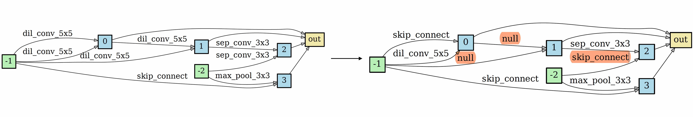
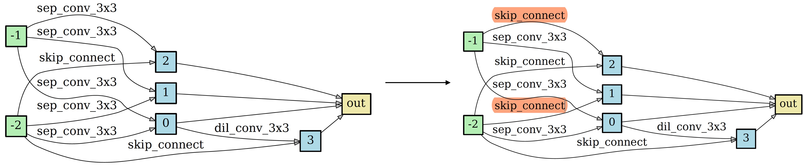

# NAT: Neural Architecture Transformer for Accurate and Compact Architectures

Pytorch implementation for "NAT: Neural Architecture Transformer for Accurate and Compact Architectures".

## A Simple Demo of NAT


<p align="center">
    
</p>


## Requirements
```
Python>=3.6, PyTorch==0.4.0, torchvision==0.2.1 graphviz=0.10.1 scipy=1.1.0 pygcn
```

Please follow the [guide](https://github.com/tkipf/pygcn) to install pygcn.

## Datasets
We consider two benchmark classification datsets, including CIFAR-10 and ImageNet.

CIFAR-10 can be automatically downloaded by torchvision.

ImageNet needs to be manually downloaded (preferably to a SSD) following the instructions [here](https://github.com/pytorch/examples/tree/master/imagenet).

## Training Method

We consider to optimize two kinds of architectures, namely loose-end architectures and fully-concat architectures. More details about these two kinds of architectures can be found in [ENAS](https://arxiv.org/abs/1802.03268) and [DARTS](https://arxiv.org/abs/1806.09055), respectively.

Train NAT for fully-concat architectures.
```
python train_search.py --data $DATA_DIR$ --num_nodes $NUM_NODES$ --op_type FULLY_CONCAT_PRIMITIVES
```

Train NAT for loose-end architectures.
```
python train_search.py --data $DATA_DIR$ --num_nodes $NUM_NODES$ --op_type LOOSE_END_PRIMITIVES
```

- DATA_DIR: path to save data.
- NUM_NODES: number of intermediate nodes in the architecture, *e.g.*, 4 for DARTS and 5 for ENAS.


## Inference Method

### 1. Put the input architectures in [genotypes.py](./genotypes.py) as follows

```
DARTS = Genotype(
    normal=[('sep_conv_3x3', 0, 2), ('sep_conv_3x3', 1, 2), ('sep_conv_3x3', 0, 3), ('sep_conv_3x3', 1, 3), ('sep_conv_3x3', 1, 4),
            ('skip_connect', 0, 4), ('skip_connect', 0, 5), ('dil_conv_3x3', 2, 5)], normal_concat=[2, 3, 4, 5],
    reduce=[('max_pool_3x3', 0, 2), ('max_pool_3x3', 1, 2), ('skip_connect', 2, 3), ('max_pool_3x3', 1, 3), ('max_pool_3x3', 0, 4),
            ('skip_connect', 2, 4), ('skip_connect', 2, 5), ('max_pool_3x3', 1, 5)], reduce_concat=[2, 3, 4, 5])
```


### 2. Feed an architecture into the transformer and obtain the transformed architecture

You can obtain the transformed architecture by taking an architecture as input, *e.g.*, --arch DARTS.  


```
python derive.py --data ./data --arch DARTS --model_path pretrained/fully_connect.pt
```

<p align="center">

</p>
<p align="center">
Figure: An example of architecture transformation.
</p>

## Architecture Visualization

You can visualize both the input and the transformed architectures by
```
python visualize.py some_arch
```
where `some_arch` should be replaced by any architecture in [genotypes.py](./genotypes.py).


## Citation

If you use any part of this code in your research, please cite our paper:

```
@inproceedings{guo2019nat,
  title={NAT: Neural Architecture Transformer for Accurate and Compact Architectures},
  author={Guo, Yong and Zheng, Yin and Tan, Mingkui and Chen, Qi and Chen, Jian and Zhao, Peilin and Huang, Junzhou},
  booktitle={Advances in Neural Information Processing Systems},
  year={2019}
}
```

