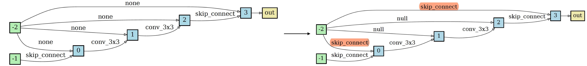

# NAT: Neural Architecture Transformer for Accurate and Compact Architectures

We provide the test interface to show the performance of NAT on transforming any arbitrary architecture.

## A simple demo

<p align="center">
    
</p>


## Requirements
```
Python>=3.6, PyTorch==0.4.0, torchvision==0.2.1 graphviz=0.10.1 scipy=1.1.0 pygcn
```

Please follow the [guide](https://github.com/tkipf/pygcn) to install pygcn.

## Datasets
We consider two benchmark classification datsets, including CIFAR-10 and ImageNet.

CIFAR-10 can be automatically downloaded by torchvision.

ImageNet needs to be manually downloaded (preferably to a SSD) following the instructions [here](https://github.com/pytorch/examples/tree/master/imagenet).


## Training the transformer

```
python nas_compact_train_search.py --init_channels 20 --layers 8 --inner_steps 9 --valid_inner_steps 9 --prefix /opt/ml/model --seed 12345 --epoch 100 --test_freq 4 --inner_lr 0.001 --learning_rate 0.01 --learning_rate_min 0.01 --data data --report_freq 50 --controller_start_training 0 --entropy_coeff 0.005 0.005 --pruner_dropout 0 --num_steps 5 --op_type LOOSE_END_PRIMITIVES --loose_end
```


## Architecture transformation (transforming any arbitrary architecture)

### 1. Put the input architectures in [genotypes.py](./genotypes.py) as follows

```
DARTS = Genotype(
    normal=[('sep_conv_3x3', 0, 2), ('sep_conv_3x3', 1, 2), ('sep_conv_3x3', 0, 3), ('sep_conv_3x3', 1, 3), ('sep_conv_3x3', 1, 4),
            ('skip_connect', 0, 4), ('skip_connect', 0, 5), ('dil_conv_3x3', 2, 5)], normal_concat=[2, 3, 4, 5],
    reduce=[('max_pool_3x3', 0, 2), ('max_pool_3x3', 1, 2), ('skip_connect', 2, 3), ('max_pool_3x3', 1, 3), ('max_pool_3x3', 0, 4),
            ('skip_connect', 2, 4), ('skip_connect', 2, 5), ('max_pool_3x3', 1, 5)], reduce_concat=[2, 3, 4, 5])
```


### 2. Feed an architecture into the transformer and obtain the transformed architecture

We release the pretrained architecture transformers for both loose-end and fully-connect architecture.

**Loose-end architecture** ([loose_end.pt](./pretrained/loose_end.pt))

You can obtain the transformed architecture by taking a loose-end architecture as input, *e.g.*, --arch VGG.  

```
python nas_compact_derive.py --data ./data --arch VGG --model_path pretrained/loose_end.pt --op_type HAND_PRIMITIVES --loose_end
```

<p align="center">

</p>
<p align="center">
Figure: An example of architecture transformation on loose-end architecture.
</p>

**Fully-connect architecture** ([fully_connect.pt](./pretrained/fully-connect.pt))

You can obtain the transformed architecture by taking a fully-connect architecture as input, *e.g.*, --arch DARTS.  


```
python nas_compact_derive.py --data ./data --arch DARTS --model_path pretrained/fully_connect.pt
```

<p align="center">

</p>
<p align="center">
Figure: An example of architecture transformation on fully-connect architecture.
</p>

You can also apply the transformer on some random architectures, *i.e.*, A1~A10 defined in [genotypes.py](./genotypes.py).

```
python nas_compact_derive.py --data ./data --arch A1 --model_path pretrained/fully_connect.pt
```

### 3. Architecture visualization

You can visualize both the input and the transformed architectures by
```
python visualize.py some_arch
```
where `some_arch` should be replaced by any architecture in [genotypes.py](./genotypes.py).

### 4. Architecture evaluation

To evaluate the performance of different architectures, we train the models from scratch on CIFAR-10 and ImageNet. We release the evaluation code for both data sets as follows.

**CIFAR-10** ([nas_compact_train_cifar.py](./nas_compact_train_cifar.py))


**ImageNet** ([nas_compact_train_imagenet.py](./nas_compact_train_imagenet.py))

